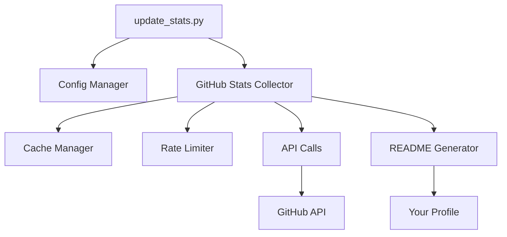

<div align="center">


<br>

<p align="center">
  
  
</p>

### 💻 Passionate Developer | 🚀 Problem Solver | 🌍 Open Source Contributor

> Building elegant solutions to complex problems, one commit at a time.

[](https://faliloumbc.github.io)
[](https://linkedin.com/in/falilouMBC)
[](https://twitter.com/falilouMBC)


</div>

<br>

## 👨‍💻 About Me

```javascript
const falilouMBC = {
    location: "🌍 Worldwide",
    role: "Full Stack Developer",
    code: ["Python", "JavaScript", "TypeScript", "Java", "PHP"],
    technologies: {
        frontEnd: ["React", "Angular", "Vue.js"],
        backEnd: ["Node.js", "Django", "Laravel", "Spring Boot"],
        databases: ["MongoDB", "PostgreSQL", "MySQL"],
        devOps: ["Docker", "GitHub Actions", "AWS"],
        tools: ["Git", "VS Code", "Postman"]
    },
    currentFocus: "Building scalable web applications & contributing to open source",
    funFact: "I debug with console.log() and I'm not ashamed! 😄"
};
```

<br>

## 🔥 GitHub Stats Automation Tool

This repository contains an **automated GitHub statistics generator** that I built to track my complete development activity, including private repositories.

<p align="center">
  <a href="#-features">Features</a> •
  <a href="#-quick-start">Quick Start</a> •
  <a href="#-documentation">Documentation</a> •
  <a href="#-tech-stack">Tech Stack</a>
</p>

<br>

## 🌟 Overview

> **Automatically generate comprehensive GitHub statistics for your profile, including private repositories**

GitHub Stats Automation is a powerful, production-ready tool that collects and displays detailed statistics from your GitHub account. Unlike other solutions, it has **full access to private repositories**, giving you truly complete analytics.

<br>

## ✨ Features

<table>
<tr>
<td width="50%">

### 📊 Comprehensive Analytics
- 🔒 **Private Repository Support**
- 📈 Customizable time periods
- 🌍 Multi-language detection
- 📉 Code change tracking
- 🔥 Activity heatmaps

</td>
<td width="50%">

### 🚀 Production Ready
- ⚡ Smart caching system
- 🛡️ Rate limit management
- 🔄 Auto-retry mechanism
- 📝 Extensive logging
- 🤖 GitHub Actions ready

</td>
</tr>
<tr>
<td width="50%">

### 🎨 Highly Customizable
- 📋 YAML configuration
- 🎭 Template system
- 🏷️ Badge customization
- 📊 Section management
- 🌈 Multiple output formats

</td>
<td width="50%">

### 🔧 Developer Friendly
- 🐍 Pure Python 3.10+
- 📦 Minimal dependencies
- 📚 Complete documentation
- 💻 10+ code examples
- 🧪 Easy to extend

</td>
</tr>
</table>

<br>

## 📊 What Gets Tracked

<div align="center">

| Metric | Description | Privacy |
|--------|-------------|---------|
| 📦 **Repositories** | Public & Private repos | ✅ Full Access |
| 📝 **Commits** | All commits in period | ✅ Full Access |
| 🔀 **Pull Requests** | Created, merged, closed | ✅ Full Access |
| ❗ **Issues** | Opened, closed | ✅ Full Access |
| ⭐ **Stars** | Total stars received | ✅ Full Access |
| 💻 **Languages** | Code distribution | ✅ Full Access |
| ➕➖ **Code Changes** | Lines added/removed | ✅ Full Access |
| 🔥 **Activity** | Day/hour heatmap | ✅ Full Access |

</div>

## 🚀 Quick Start

<details>
<summary><b>📋 Prerequisites</b></summary>
<br>

- Python 3.10 or higher
- Git installed
- GitHub account with token creation permissions
- A public repository named exactly as your username (for profile stats)

</details>

<details open>
<summary><b>⚡ Installation (5 minutes)</b></summary>
<br>

### Step 1: Clone the Repository

```bash
git clone https://github.com/falilouMBC/github_pr_automation.git
cd github_pr_automation
```

### Step 2: Install Dependencies

```bash
pip install requests pyyaml
```

> 💡 **Optional**: Create a virtual environment first
> ```bash
> python -m venv venv
> source venv/bin/activate  # On Windows: venv\Scripts\activate
> ```

### Step 3: Create Your GitHub Token

1. Go to [GitHub Settings → Tokens](https://github.com/settings/tokens)
2. Click **"Generate new token (classic)"**
3. Name it: `GitHub Stats Automation`
4. Select scopes:
   - ✅ `repo` (Full control of private repositories)
   - ✅ `user` (Read user profile data)
5. Click **"Generate token"**
6. **Copy the token** (starts with `ghp_`)

### Step 4: Configure Environment

Create a `.env` file at the project root:

```bash
GITHUB_TOKEN=ghp_your_token_here
GITHUB_USERNAME=your_github_username
```

Or use the verification script to create it:

```bash
python scripts/check_env.py
```

### Step 5: Verify Setup

```bash
python scripts/check_env.py
```

Expected output:
```
✅ Configuration loaded
✅ All required variables present
✅ Token format valid
✅ Username format valid
✅ API connection successful
```

### Step 6: Run!

```bash
# Test mode (doesn't publish)
python scripts/update_stats.py --dry-run

# For real (updates your profile)
python scripts/update_stats.py
```

🎉 **Done!** Check your profile at `https://github.com/your_username`

</details>

## 💻 Usage

<div align="center">

### Basic Commands

</div>

```bash
# Standard run (updates your profile)
python scripts/update_stats.py

# Dry run (preview without publishing)
python scripts/update_stats.py --dry-run

# Verify environment setup
python scripts/check_env.py
```

<details>
<summary><b>🎛️ Advanced Options</b></summary>
<br>

| Option | Description | Example |
|--------|-------------|---------|
| `--dry-run` | Preview without publishing | `python scripts/update_stats.py --dry-run` |
| `--no-cache` | Bypass cache, fetch fresh data | `python scripts/update_stats.py --no-cache` |
| `--verbose` | Enable detailed logging | `python scripts/update_stats.py --verbose` |
| `--clear-cache` | Clear cache before running | `python scripts/update_stats.py --clear-cache` |
| `--json FILE` | Export stats to JSON | `python scripts/update_stats.py --json stats.json` |
| `--output FILE` | Custom README output | `python scripts/update_stats.py --output README.md` |
| `--config FILE` | Custom config file | `python scripts/update_stats.py --config custom.yaml` |
| `--show-config` | Display current configuration | `python scripts/update_stats.py --show-config` |

### Combined Options

```bash
# Debug mode with fresh data
python scripts/update_stats.py --verbose --no-cache --dry-run

# Production run with JSON export
python scripts/update_stats.py --json stats/backup.json

# Clean run
python scripts/update_stats.py --clear-cache --no-cache
```

</details>

## 📁 Project Structure

```
github_pr_automation/
│
├── 📂 .github/workflows/
│   └── update-stats.yml           # 🤖 GitHub Actions workflow
│
├── 📂 configs/
│   ├── config.yaml                # ⚙️  Main configuration
│   └── env.example                # 📝 Environment template
│
├── 📂 docs/
│   ├── QUICKSTART.md              # 🚀 5-minute setup guide
│   ├── ENV_SETUP.md               # 🔐 .env configuration
│   └── DEVELOPER_GUIDE.md         # 👨‍💻 Developer documentation
│
├── 📂 scripts/
│   ├── update_stats.py            # 🎯 Main entry point
│   └── check_env.py               # ✅ Environment validator
│
├── 📂 src/                        # 🏗️  Core modules
│   ├── __init__.py                # 📦 Package initialization
│   ├── github_stats.py            # 📊 Statistics collector
│   ├── cache_manager.py           # 💾 Intelligent caching
│   ├── rate_limiter.py            # 🛡️  Rate limit handler
│   ├── config.py                  # ⚙️  Configuration manager
│   ├── env_loader.py              # 🔐 .env file loader
│   └── utils.py                   # 🔧 Utility functions
│
├── 📂 templates/
│   └── profile_template.md        # 🎨 README template
│
├── 📂 exemples/
│   └── example_usage.py           # 💡 10+ usage examples
│
├── 📄 .env                        # 🔒 Your credentials (create this)
├── 📄 .gitignore                  # 🚫 Ignored files
├── 📄 README.md                   # 📊 Your profile stats
└── 📄 LICENSE                     # ⚖️  MIT License
```

<div align="center">

### 🏗️ Architecture Overview



</div>

## 🤖 GitHub Actions Automation

<div align="center">

### ⚡ Automatic Daily Updates

Set it up once, and your profile stats update automatically every day!

</div>

<details>
<summary><b>📝 Setup Instructions</b></summary>
<br>

### Step 1: Create Profile Repository

Create a public repository with the **exact same name** as your username:

```
https://github.com/your_username/your_username
```

### Step 2: Add GitHub Secret

1. Go to your **profile repository** settings
2. Navigate to: `Settings` → `Secrets and variables` → `Actions`
3. Click `New repository secret`
4. Add:
   - **Name**: `STATS_TOKEN`
   - **Value**: Your GitHub token (the one starting with `ghp_`)
5. Click `Add secret`

### Step 3: Copy Workflow File

```bash
# From this project
cp .github/workflows/update-stats.yml ../your_username/.github/workflows/

# Navigate to your profile repo
cd ../your_username

# Commit and push
git add .github/workflows/update-stats.yml
git commit -m "🤖 Add automated stats updater"
git push
```

### Step 4: Enable Workflow

1. Go to the `Actions` tab in your profile repository
2. You should see **"Update GitHub Stats"** workflow
3. Click on it and enable if needed
4. Click `Run workflow` to test manually

</details>

<details>
<summary><b>⏰ Schedule Configuration</b></summary>
<br>

The workflow runs:

- 🕐 **Daily at midnight UTC** (automatic)
- 🖱️ **On-demand** (manual trigger from Actions tab)
- 📝 **On push** to workflow file (optional)

Customize the schedule in `.github/workflows/update-stats.yml`:

```yaml
on:
  schedule:
    - cron: '0 0 * * *'     # Daily at 00:00 UTC
    # - cron: '0 */6 * * *' # Every 6 hours
    # - cron: '0 12 * * *'  # Daily at noon
```

</details>

---

## 📊 Exemples de Sorties

### Console

```
═══════════════════════════════════════════════════════════════
📊 RÉSUMÉ DES STATISTIQUES
═══════════════════════════════════════════════════════════════

📦 DÉPÔTS
   Total                :              26
   └─ Publics           :              17
   └─ Privés            :               9

⭐ ÉTOILES
   Total                :               7

📝 COMMITS
   Derniers 365 jours   :              95

🔀 PULL REQUESTS
   Total                :              23
   ├─ Ouvertes          :               0
   ├─ Mergées           :              23
   └─ Fermées           :              23

💻 TOP 5 LANGAGES
   1. Java                      :      34.1%
   2. TypeScript                :      33.2%
   3. PHP                       :      11.2%
   4. Blade                     :       8.7%
   5. HTML                      :       3.9%
```

### README Généré

Voir votre profil : https://github.com/falilouMBC

## 🛠️ Tech Stack

<div align="center">

### Built With


### Core Dependencies


### CI/CD & Automation


</div>

<br>

## ⚙️ Configuration

Éditez `configs/config.yaml` :

```yaml
github:
  token: ""  # Chargé depuis .env
  username: ""

stats:
  days_back: 365              # Période d'analyse
  include_private: true       # Inclure privés
  include_languages: true     # Analyser langages
  include_heatmap: true       # Heatmap d'activité

cache:
  enabled: true               # Activer cache
  max_age_hours: 24           # Validité

readme:
  sections:                   # Sections à afficher
    - stats
    - repos
    - languages
    - activity
  badge_style: "for-the-badge"
```

---

## 🎨 Personnalisation

### Changer les Sections

```yaml
readme:
  sections:
    - header
    - stats
    - repos
    - prs
    - issues
    - languages
    - activity
    - technologies
    - contact
```

### Changer le Style

```yaml
readme:
  badge_style: "flat-square"  # flat, flat-square, for-the-badge
```

### Période d'Analyse

```yaml
stats:
  days_back: 180  # 6 mois au lieu d'un an
```

---

## 📚 Documentation

- 📖 [Guide de Démarrage Rapide](docs/QUICKSTART.md)
- 📖 [Configuration .env](docs/ENV_SETUP.md)
- 📖 [Guide du Développeur](docs/DEVELOPER_GUIDE.md)
- 📖 [Exemples d'Utilisation](exemples/example_usage.py)

---

## 🔧 Dépannage

### "Token manquant"

```bash
# Vérifier que .env existe et contient
cat .env

# Doit afficher :
# GITHUB_TOKEN=ghp_...
# GITHUB_USERNAME=...
```

### "Rate limit exceeded"

```bash
# Activer le cache
# Dans config.yaml :
cache:
  enabled: true
  max_age_hours: 24
```

### Le README ne s'affiche pas

1. Le repo doit être **public**
2. Le repo doit s'appeler **exactement** comme votre username
3. Le fichier doit s'appeler `README.md`

## 🤝 Contributing

Contributions, issues, and feature requests are welcome!

Feel free to check the [issues page](https://github.com/falilouMBC/github_pr_automation/issues) if you want to contribute.

<details>
<summary><b>🔧 How to Contribute</b></summary>
<br>

1. **Fork** the repository
2. **Create** your feature branch
   ```bash
   git checkout -b feature/AmazingFeature
   ```
3. **Commit** your changes
   ```bash
   git commit -m 'Add some AmazingFeature'
   ```
4. **Push** to the branch
   ```bash
   git push origin feature/AmazingFeature
   ```
5. **Open** a Pull Request

</details>

<br>

## 📝 License

This project is licensed under the **MIT License** - see the [LICENSE](LICENSE) file for details.

<br>

## 💫 Show Your Support

Give a ⭐️ if this project helped you!

<div align="center">

[](https://github.com/falilouMBC/github_pr_automation/stargazers)
[](https://github.com/falilouMBC/github_pr_automation/network/members)

</div>

<br>

## 📬 Contact

<div align="center">

### Let's Connect! 🌐

[](mailto:contact@faliloumbc.com)
[](https://linkedin.com/in/falilouMBC)
[](https://twitter.com/falilouMBC)
[](https://github.com/falilouMBC)

</div>

<br>

---

<div align="center">


### Made with 💜 by [Falilou MBC](https://github.com/falilouMBC)

<p align="center">
  
</p>

**⭐ Star this repo if you find it useful! ⭐**

<sub>Built with Python • Automated with GitHub Actions • Powered by Coffee ☕</sub>

</div>

